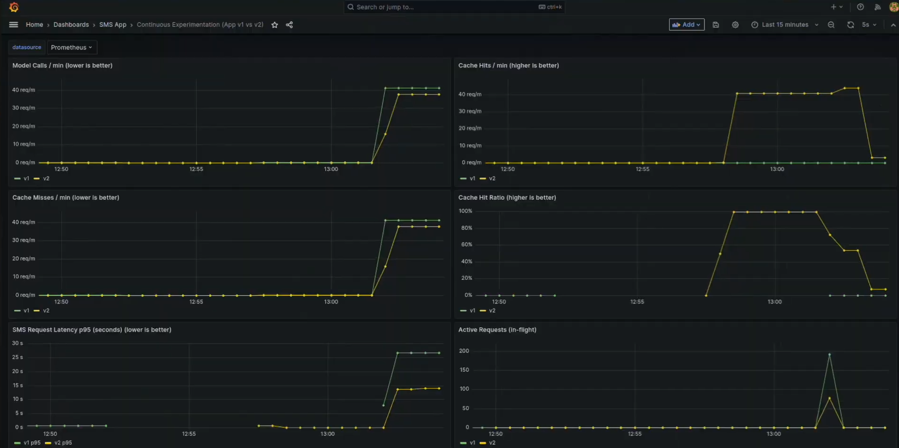

# Continuous Experimentation

## Overview

This experiment evaluates a new version (v2) of the **app-service** that introduces an in-memory cache for SMS classification requests. The objective is to measure whether caching reduces load on the model-service and improves throughput, while observing the impact on latency and runtime behavior.

Two versions of the system are deployed simultaneously:

| Service | Stable (v1) | Canary (v2) |
|----------|-------------|--------------|
| app-service | No cache | TTL-based in-memory cache |
| model-service | Baseline | Identical logic |

Istio DestinationRules and VirtualServices ensure **consistent routing**, so:
- app v1 always calls model v1
- app v2 always calls model v2
- mixed-version traffic (v1 → v2 or v2 → v1) is avoided

Traffic is split using canary routing. This isolation ensures that all observed differences can be attributed solely to the cache introduced in app-service v2.

---

## What Changed Compared to the Base Design

### App-service v2 Improvements

The following changes were introduced in v2:

#### 1. In-Memory Cache
- A thread-safe `ConcurrentHashMap` stores SMS predictions.
- Each entry has a **5-minute TTL**.
- Repeated requests for the same SMS bypass the model-service.
- Cache eviction happens automatically based on expiration time.
- This change targets backend load reduction and latency improvement for repeated requests.

#### 2. Additional Metrics

New Prometheus counters and gauges were introduced:

| Metric | Description |
|--------|-------------|
| `sms_cache_hits_total` | Number of cache hits |
| `sms_cache_misses_total` | Number of cache misses |
| `sms_model_calls_total` | Number of calls made to the model-service |
| `sms_request_latency_seconds` | End-to-end request latency |
| `sms_active_requests` | Concurrent in-flight requests |

All metrics include a version label (`v1` or `v2`) to enable side-by-side comparison.

#### 3. Version Visibility

The UI and metrics expose the running version (`v1` or `v2`) so that routing behavior can be verified during the experiment.

---

## Hypothesis

**H₀ (Null Hypothesis):**  
Adding an in-memory cache in app-service v2 does not significantly change model load, latency, or system behavior compared to v1.

**H₁ (Alternative Hypothesis):**  
App-service v2 reduces model-service calls for repeated requests but may introduce measurable side effects in latency or concurrency behavior.

---

## Experiment Setup

### Deployment

- Both versions are deployed through the Helm central chart.
- Canary routing is enabled in Istio with a weighted split:
  - 90% → v1
  - 10% → v2
- Version labels (version=v1, version=v2) are used by DestinationRules.
- Version-specific configuration (image tags, labels, routing rules, hostnames) is fully controlled via Helm values.
- Routing guarantees consistent version pairing between app and model.

### Traffic Generation

Traffic is generated by repeatedly sending identical SMS payloads using curl scripts and the UI.  
This pattern intentionally creates cache opportunities for v2 while v1 always forwards requests to the model-service.

## Accessing Stable and Canary Versions

Dedicated hostnames allow direct testing:

- **Stable (v1):** `http://stable.sms-app.local`
- **Canary (v2):** `http://canary.sms-app.local`

This avoids relying solely on probabilistic traffic splitting during validation.

---

## Evaluation Methodology

The hypothesis is evaluated by comparing the behavior of the stable version (v1, no cache) and the canary version (v2, with cache) using Prometheus metrics visualized in Grafana. All metrics are labeled by `version`, enabling direct side-by-side comparison in dashboards.

The following metrics are used:

### Cache Effectiveness

- **`sms_cache_hits_total`** and **`sms_cache_misses_total`**
- The cache hit ratio indicates how often repeated SMS requests are served directly from memory in v2.
- A higher hit ratio in v2 demonstrates effective caching behavior.
- v1 is expected to have no cache hits.

### Model Load Reduction

- **`sms_model_calls_total`**
- Measures how many requests are forwarded to the model-service.
- A lower rate for v2 compared to v1 indicates that the cache successfully reduces backend load.

### Latency

- **`sms_request_latency_seconds` (p95)**
- Measures end-to-end request latency.
- v2 should show lower or equal latency compared to v1, especially for repeated requests that are served from cache.

### Concurrency and Stability

- **`sms_active_requests`**
- Ensures that the cache does not introduce concurrency issues or request buildup.

---

## Decision Criteria and Decision Process

The canary version (v2) is accepted if all of the following conditions are satisfied:

1. **Cache utilization**: v2 shows a consistently non-zero cache hit rate while v1 remains at zero.
2. **Reduced model load**: v2 generates fewer model-service calls per minute than v1 for similar traffic patterns.
3. **Latency improvement or no regression**:  The p95 latency of v2 is equal to or lower than v1 during steady traffic.
4. **Operational stability**:  No increase in active requests, error rates, or abnormal behavior is observed for v2.

These criteria ensure that the cache improves performance without introducing regressions or instability.

---

## Results

### Grafana Dashboard

The experiment dashboard is shown below:

---

### Observations

#### Cache Behavior
- **v2 shows a clear increase in cache hits** after repeated requests.
- **v1 shows zero cache hits**, as expected.
- Cache misses increase initially for v2 and then stabilize as entries become cached.

This confirms that the cache logic in v2 is functioning correctly.

#### Model Service Calls
- v2 initially performs model calls during cache warm-up.
- Once the cache is populated, **v2 produces fewer model calls than v1**.
- v1 continues to call the model for every request.

This demonstrates that caching reduces backend load.

#### Latency (p95)
- The p95 latency for **v2 is consistently lower than v1**.
- Once the cache is warmed up, repeated requests are served from memory instead of invoking the model-service.
- This reduces end-to-end processing time for v2 compared to v1.
- The separation between the curves indicates a clear latency improvement for the cached version.

This confirms that the cache improves user-perceived response time under repeated workloads.

#### Active Requests
- v2 shows a brief spike in active in-flight requests during traffic bursts.
- v1 remains mostly flat.
- The spike is short-lived and does not persist, indicating no sustained overload or instability.

This behavior suggests minor transient concurrency effects but no long-term operational risk.

---

## Interpretation and Decision

Based on the observed metrics, all decision criteria are satisfied when evaluated together:

- The cache in v2 achieves measurable cache hits. 
- Model-service load is reduced for v2. 
- No latency regressions are observed. 
- System stability remains unaffected.

Therefore, the null hypothesis (H₀) is rejected and the alternative hypothesis (H₁) is accepted.
The cached canary version (v2) demonstrates clear performance benefits and can be safely promoted to stable.

---

## Reflection

### Limitations

- Only 10% of traffic is routed to the canary, which slows down metric convergence and statistical confidence.
- Traffic generation was manual (browser and curl), which may not fully represent real production workloads.
- The experiment focuses mainly on latency and backend load and long-term memory usage and cache eviction behavior were not evaluated.

### Future Improvements
- Perform controlled load testing using a benchmark tool.
- Experiment with different cache TTL values and cache sizes.
- Introduce additional metrics such as memory consumption and error rates.
- Gradually increase canary traffic percentage for higher confidence validation.
