# Deployment Architecture

This document describes the final deployment architecture of the **SMS Spam Detection System** as deployed on a Kubernetes cluster provisioned using Vagrant, VirtualBox, and Ansible. It focuses on:

- How each component is deployed and interacts with the others
- How user requests flow through the system
- How Istio handles weighted and sticky routing
- How continuous experimentation (canary) and shadow model launches are implemented
- How observability (Prometheus + Grafana) is integrated

This document is intended to give new contributors a clear, high-level understanding of the design so they can confidently participate in design and implementation discussions.

---

## Table of Contents

- [1. System Overview](#1-system-overview)
- [2. High-Level Architecture](#2-high-level-architecture)
  - [2.1 Design Decisions and Trade-offs](#21-design-decisions-and-trade-offs)
- [3. Deployment Structure](#3-deployment-structure)
  - [3.1 Kubernetes Resources](#31-kubernetes-resources)
- [4. Networking & Access Points](#4-networking--access-points)
- [5. Request Flow](#5-request-flow)
  - [5.1 Full Request Path Through The System](#51-full-request-path-through-the-system)
  - [5.2 Ingress-Level Routing (NGINX)](#52-ingress-level-routing-nginx)
- [6. Istio Traffic Management](#6-istio-traffic-management)
  - [6.1 Host-Based Routing](#61-host-based-routing)
  - [6.2 90/10 Traffic Split](#62-9010-traffic-split)
  - [6.3 Sticky Sessions](#63-sticky-sessions)
  - [6.4 Paired Routing (App ↔ Model Version Alignment)](#64-paired-routing-app--model-version-alignment)
- [7. Model Shadow Launch (Alternative Use Case)](#7-model-shadow-launch-alternative-use-case)
- [8. Monitoring & Observability](#8-monitoring--observability)
- [9. Storage: HostPath Model Directory](#9-storage-hostpath-model-directory)
- [10. Where Routing Decisions Happen](#10-where-routing-decisions-happen)

---

## Glossary

- **CRD (Custom Resource Definition)**  
  Kubernetes mechanism to define custom resource types (e.g., `PrometheusRule`, `ServiceMonitor`, `AlertmanagerConfig`).

- **VirtualService (VS)**  
  Istio resource that controls how requests are routed to services (e.g., 90/10 split, mirroring rules).

- **DestinationRule (DR)**  
  Istio resource that defines subsets (like `v1`, `v2`) and traffic policies (e.g., sticky sessions via cookies).

- **Subset**  
  A version-specific group of pods defined in a `DestinationRule`, typically labeled by `version` (e.g., `v1` for stable, `v2` for canary).

- **Paired Routing**  
  Routing strategy where app version and model version are aligned (app v1 → model v1, app v2 → model v2), enabling end-to-end experimentation.

- **Mirroring (Shadow Traffic)**  
  Copying live traffic to another service instance (e.g., new model version) without affecting the user-facing response, used to evaluate new versions safely.

- **Ingress**  
  Kubernetes resource that exposes HTTP(S) services from inside the cluster to the outside world (here: NGINX Ingress at `sms-nginx.local`).

- **Istio Gateway**  
  Istio's entry point for external traffic, similar to an Ingress but for Istio-managed routes (here: `sms-app.local`, `stable.sms-app.local`, `canary.sms-app.local`).

---

## 1. System Overview

The system is an end-to-end **SMS spam detection** platform composed of:

- A **Spring Boot app service**:
  - Serves the HTML/JS web UI
  - Exposes HTTP endpoints
  - Acts as an API gateway toward the model service
- A **Python model service**:
  - Hosts the ML model for spam classification
  - Loads model artifacts from shared storage

The application is deployed to a **Kubernetes cluster** and exposed to users via:

- A classic **NGINX Ingress** for direct stable access (`sms-nginx.local`)
- An **Istio Gateway + VirtualService** for experimental traffic with three hosts:
  - `sms-app.local` — weighted 90/10 experiment traffic
  - `stable.sms-app.local` — force stable (v1) only
  - `canary.sms-app.local` — force canary (v2) only

Core goals of the deployment:

- Isolate concerns (frontend/app, model, monitoring, traffic mgmt)
- Support **canary releases** (90/10 split with sticky sessions)
- Support **paired routing** for continuous experimentation (app v2 → model v2)
- Support **shadow launches** for new model versions (alternative mode)
- Provide **observability** via Prometheus + Grafana and **alerting** via Alertmanager

The overall architecture is shown in Figure 1.


The components divided by namespace are shown in Figure 2.

```mermaid
---
title: Figure 2 - Namespace and Component Relationships
---
flowchart TB
    subgraph external[" "]
        Browser[("🌐 Browser")]
    end

    subgraph ingress-nginx["ingress-nginx namespace"]
        NGINX["NGINX Ingress<br/>192.168.56.95<br/>sms-nginx.local"]
    end

    subgraph istio-system["istio-system namespace"]
        IstioGW["Istio Gateway<br/>192.168.56.96<br/>sms-app.local<br/>stable.sms-app.local<br/>canary.sms-app.local"]
    end

    subgraph sms-app["sms-app namespace"]
        subgraph app["App Service (Spring Boot)"]
            AppV1["sms-app-app<br/>v1 - Stable"]
            AppV2["sms-app-app-canary<br/>v2 - Canary"]
        end
        subgraph model["Model Service (Python ML)"]
            ModelV1["sms-app-model<br/>v1 - Stable"]
            ModelV2["sms-app-model-canary<br/>v2 - Canary"]
        end
        Storage[("HostPath<br/>/mnt/shared/models")]
        subgraph monitoring-resources["Monitoring Resources"]
            SM["ServiceMonitors"]
            PR["PrometheusRules"]
            GD["Grafana Dashboards"]
        end
    end

    subgraph prom-ns["Prometheus Stack (kube-prometheus-stack)"]
        Prometheus["Prometheus"]
        Grafana["Grafana<br/>grafana.local"]
        Alertmanager["Alertmanager"]
    end

    Browser --> NGINX
    Browser --> IstioGW
    NGINX --> AppV1
    IstioGW --> AppV1
    IstioGW --> AppV2
    AppV1 --> ModelV1
    AppV2 --> ModelV2
    ModelV1 --> Storage
    ModelV2 --> Storage
    SM -.-> Prometheus
    PR -.-> Prometheus
    GD -.-> Grafana
    Prometheus --> Grafana
    Prometheus --> Alertmanager

    style ingress-nginx fill:#a6ffa1,stroke:#22c55e
    style istio-system fill:#c6a1ff,stroke:#a855f7
    style sms-app fill:#83e8fc,stroke:#3b82f6
    style prom-ns fill:#fcec83,stroke:#eab308
```



---

## 2. High-Level Architecture

The system consists of several components deployed in the `sms-app` namespace:

- **App Service (Spring Boot)**
  Serves the frontend and acts as the API gateway. Deployed as both stable (v1) and canary (v2).

- **Model Service (Python ML API)**
  Performs SMS classification. Deployed as both stable (v1) and canary (v2) for paired routing.

- **Shadow Model Service (alternative mode)**
  When shadow mode is enabled instead of canary mode, it receives mirrored traffic from v1 for experimentation without user exposure.

- **NGINX Ingress Controller**
  Provides cluster-wide ingress at `sms-nginx.local`.

- **Istio Ingress Gateway**
  Used for traffic management with host-based routing:
  - `sms-app.local` — weighted experiment traffic
  - `stable.sms-app.local` — force stable version
  - `canary.sms-app.local` — force canary version

- **Prometheus + Alertmanager + Grafana**
  Installed via `kube-prometheus-stack`, optionally enabled.

Additional infrastructure components:

- **MetalLB** (bare-metal LoadBalancer support)
- **Flannel** (pod networking)
- **HostPath shared storage** at `/mnt/shared/models` (common to all VMs)

### 2.1 Design Decisions and Trade-offs

| Decision                                                                  | Why                                                                                                                                                          | Trade-off                                                                                       |
| ------------------------------------------------------------------------- | ------------------------------------------------------------------------------------------------------------------------------------------------------------ | ----------------------------------------------------------------------------------------------- |
| Use **Istio** (in addition to NGINX) for canary & shadow traffic          | Istio gives first-class support for weighted routing, sticky sessions, host-based routing, and traffic mirroring without changing application code.          | More moving parts (Gateway, VirtualService, DestinationRule), higher operational complexity.    |
| Implement **host-based routing** with three Istio hosts                   | Allows testers to force specific versions (`stable.sms-app.local`, `canary.sms-app.local`) while experiment traffic uses weighted routing (`sms-app.local`). | Requires DNS/hosts configuration for all three hostnames.                                       |
| Implement **90/10 canary** with **sticky sessions via cookie**            | A weighted canary lets us gradually roll out v2 while limiting blast radius. Sticky sessions ensure users consistently see the same version.                 | Individual users don't experience both variants. Misconfiguring cookie TTL could skew traffic.  |
| Use **paired routing** (app v2 → model v2) for continuous experimentation | Enables end-to-end A/B testing of both app and model changes together. Metrics can be compared by version label.                                             | Requires deploying canary versions of both app and model services.                              |
| Support **shadow model** as alternative to canary                         | Shadow launch lets us test a new model under real production traffic without impacting user-visible behavior.                                                | Doubles inference work for mirrored requests. Shadow and canary modes are mutually exclusive.   |
| Store model artifacts on a **hostPath shared directory**                  | Keeps Docker images small and allows updating model files without rebuilding images.                                                                         | Tightly couples the cluster to the underlying VM layout; not suitable for cloud-native storage. |
| Use **kube-prometheus-stack** for monitoring & alerting                   | Reuses a well-maintained chart that bundles Prometheus, Alertmanager, Grafana, and CRDs.                                                                     | Less fine-grained control; more CRDs to understand.                                             |

---

## 3. Deployment Structure

### 3.1 Kubernetes Resources

**App**

| Resource                          | Description                                                 |
| --------------------------------- | ----------------------------------------------------------- |
| Deployment (`sms-app-app`)        | Stable version (v1)                                         |
| Deployment (`sms-app-app-canary`) | Canary version (v2), receives 10% of experiment traffic     |
| Service (`sms-app-app`)           | Internal service for all app pods                           |
| ConfigMap                         | Provides MODEL_HOST, APP_SERVER_PORT, and app configuration |
| Secret                            | Holds SMTP password (pre-deployed `smtp-credentials`)       |

**Model**

| Resource                            | Description                                                |
| ----------------------------------- | ---------------------------------------------------------- |
| Deployment (`sms-app-model`)        | Stable model version (v1)                                  |
| Deployment (`sms-app-model-canary`) | Canary model (v2), paired with app v2                      |
| Deployment (`sms-app-model-shadow`) | Shadow model (alternative mode), receives mirrored traffic |
| Service (`sms-app-model`)           | Main internal model endpoint (ClusterIP)                   |
| Service (`sms-app-model-v1`)        | Version-specific service for v1 pods                       |
| Service (`sms-app-model-v2`)        | Version-specific service for v2 pods                       |
| hostPath Volume                     | Shared model artifacts under `/mnt/shared/models`          |

**Istio**

| Resource                             | Purpose                                                                                         |
| ------------------------------------ | ----------------------------------------------------------------------------------------------- |
| Gateway (`sms-app-gateway`)          | Exposes the app at three hosts: `sms-app.local`, `stable.sms-app.local`, `canary.sms-app.local` |
| VirtualService (`sms-app-vs`)        | Defines host-based routing: stable host → v1, canary host → v2, experiment host → 90/10 split   |
| DestinationRule (`sms-app-app-dr`)   | Defines app subsets (v1/v2/shadow) + sticky cookie                                              |
| DestinationRule (`sms-app-model-dr`) | Defines model subsets (v1/v2/shadow)                                                            |
| VirtualService (`sms-app-model-vs`)  | Routes model traffic: paired routing (app v2 → model v2) or shadow mirroring                    |

**Ingress**

| Resource                    | Purpose                                        |
| --------------------------- | ---------------------------------------------- |
| Ingress (`sms-app-ingress`) | HTTP access through NGINX at `sms-nginx.local` |

**Monitoring**

| Resource                         | Purpose                                                     |
| -------------------------------- | ----------------------------------------------------------- |
| ServiceMonitor (app)             | Scrapes `/metrics` from app service, adds `version` label   |
| ServiceMonitor (model)           | Scrapes `/metrics` from model service, adds `version` label |
| PrometheusRule                   | Alerts on high request throughput (>15 req/min for 2m)      |
| ConfigMap (app dashboard)        | SMS App Metrics dashboard                                   |
| ConfigMap (experiment dashboard) | Continuous Experimentation dashboard (v1 vs v2 comparison)  |

---

## 4. Networking & Access Points

| Component                        | Hostname                        | Source                         |
| -------------------------------- | ------------------------------- | ------------------------------ |
| Application (NGINX)              | **http://sms-nginx.local**      | NGINX Ingress                  |
| Application (Istio - Experiment) | **http://sms-app.local**        | Istio Gateway (90/10 weighted) |
| Application (Istio - Stable)     | **http://stable.sms-app.local** | Istio Gateway (100% v1)        |
| Application (Istio - Canary)     | **http://canary.sms-app.local** | Istio Gateway (100% v2)        |
| Grafana                          | **http://grafana.local**        | kube-prometheus-stack          |
| Kubernetes Dashboard             | **https://dashboard.local**     | via NGINX Ingress              |

LoadBalancer IP assignments:

| Service       | LoadBalancer IP   |
| ------------- | ----------------- |
| NGINX Ingress | **192.168.56.95** |
| Istio Gateway | **192.168.56.96** |

---

## 5. Request Flow

### 5.1 Full Request Path Through the System

**Browser → Ingress → App → Model → Response**

```
+------------------+     +----------------------+
| User Browser     | --> | NGINX Ingress        | --> (direct to v1)
+------------------+     | or Istio Gateway     |     (host-based routing)
                         +----------------------+
                                   |
                                   v
                          +------------------+
                          | App Service      |
                          | (v1 or v2)       |
                          +------------------+
                                   |
                                   v (paired routing)
                     +------------------------------+
                     | Model Service                |
                     | (v1 if app v1, v2 if app v2) |
                     +------------------------------+
```

> Note: We maintain separate ingress paths to isolate experimental traffic from stable production traffic. NGINX (`sms-nginx.local`) always routes to stable v1. Istio provides three hosts for different routing behaviors.

### 5.2 Ingress-Level Routing (NGINX)

Requests sent to `sms-nginx.local` are handled using this path:

```
Host: sms-nginx.local -> NGINX Ingress -> sms-app-app Service (port 80) -> App v1
```

Istio does not control this traffic. It is purely a standard HTTP ingress path to the stable version.

---

## 6. Istio Traffic Management

Requests sent to Istio-managed hosts pass through the Gateway and VirtualService, as depicted in Figure 3.


### 6.1 Host-Based Routing

The Istio VirtualService implements three distinct routing rules based on the `Host` header:

| Host                   | Routing Behavior           | Use Case                         |
| ---------------------- | -------------------------- | -------------------------------- |
| `stable.sms-app.local` | 100% to App v1             | Testing/debugging stable version |
| `canary.sms-app.local` | 100% to App v2             | Testing/debugging canary version |
| `sms-app.local`        | 90% v1 / 10% v2 (weighted) | Production experiment traffic    |

From [`istio-virtualservice.yaml`](../helm/chart/templates/istio-virtualservice.yaml):

```yaml
http:
  # Force STABLE
  - name: app-stable-host
    match:
      - authority:
          exact: "stable.sms-app.local"
    route:
      - destination:
          host: sms-app-app
          subset: v1
        weight: 100
  # Force CANARY
  - name: app-canary-host
    match:
      - authority:
          exact: "canary.sms-app.local"
    route:
      - destination:
          host: sms-app-app
          subset: v2
        weight: 100
  # EXPERIMENT traffic (weighted)
  - name: app-experiment-weighted
    match:
      - authority:
          exact: "sms-app.local"
    route:
      - destination:
          host: sms-app-app
          subset: v1
        weight: 90
      - destination:
          host: sms-app-app
          subset: v2
        weight: 10
```

### 6.2 90/10 Traffic Split

From [`values.yaml`](../helm/chart/values.yaml):

```yaml
istio:
  canary:
    weights:
      stable: 90
      canary: 10
```

For requests to `sms-app.local`:

- **90% of requests** go to stable app pods (v1)
- **10% of requests** go to canary pods (v2)

### 6.3 Sticky Sessions

To ensure users consistently see the same version during the experiment, Istio uses a **consistent hashing cookie** defined in From [`istio-destinationrule.yaml`](../helm/chart/templates/istio-destinationrule.yaml)::

```yaml
trafficPolicy:
  loadBalancer:
    consistentHash:
      httpCookie:
        name: sms-app-version
        ttl: 3600s
```

Effect:

- First request → user is assigned version v1 or v2
- Cookie is set → same version served on subsequent requests
- Ensures stable UX and cleaner experiment data

> Important: The `sms-app-version` cookie ensures users see the same app version during their session (1 hour TTL). This is critical for clean experiment data.

### 6.4 Paired Routing (App ↔ Model Version Alignment)

When canary mode is enabled (and shadow mode is disabled), the Model VirtualService implements **paired routing** based on the calling pod's version label defined in [`istio-model-virtualservice.yaml`](../helm/chart/templates/istio-model-virtualservice.yaml):

```yaml
http:
  # App v2 pods call Model v2
  - name: model-for-app-canary
    match:
      - sourceLabels:
          version: "v2"
    route:
      - destination:
          host: sms-app-model
          subset: v2
  # Default: App v1 pods call Model v1
  - name: model-default-stable
    route:
      - destination:
          host: sms-app-model
          subset: v1
```

This ensures:

- **App v1 → Model v1** (stable end-to-end path)
- **App v2 → Model v2** (canary end-to-end path)

Benefits:

- Enables true end-to-end A/B testing
- Metrics can be compared by `version` label
- No cross-contamination between experiment variants

---

## 7. Model Shadow Launch (Alternative Use Case)

Shadow mode is an **alternative** to canary mode (they are mutually exclusive). When `modelService.shadow.enabled: true` and `modelService.canary.enabled: false`:

### Core Concepts

- The app continues calling the stable model (v1)
- Istio mirrors a percentage of traffic to the shadow model
- Shadow responses do not affect user-visible behavior
- Shadow logs + metrics allow comparison of v1 vs shadow offline

### How It Works

```
App (v1 only)
   |
   | POST /predict
   |
   v
Model v1 (serves user)
   \
    \----> Istio Mirror ----> Model Shadow
```

### Istio Mirror Configuration

From [`istio-model-virtualservice.yaml`](../helm/chart/templates/istio-model-virtualservice.yaml):

```yaml
http:
  - name: model-stable-with-shadow
    route:
      - destination:
          host: sms-app-model
          subset: v1
    mirror:
      host: sms-app-model
      subset: shadow
    mirrorPercentage:
      value: 10 # configurable via values.yaml
```

### Shadow vs Canary Mode

| Aspect                | Canary Mode                        | Shadow Mode                      |
| --------------------- | ---------------------------------- | -------------------------------- |
| User exposure         | Users see v2 responses (10%)       | Users never see shadow responses |
| Model deployment      | `sms-app-model-canary`             | `sms-app-model-shadow`           |
| Traffic handling      | Real responses to users            | Fire-and-forget (discarded)      |
| Use case              | Gradual rollout with user feedback | Safe testing under real load     |
| `SHADOW_MODE` env var | `false`                            | `true`                           |

---

## 8. Monitoring & Observability

The monitoring stack is deployed via `kube-prometheus-stack` with resources in the `sms-app` namespace. Figure 4 shows the metrics flow.


### App Service Metrics

- **Endpoint:** `/metrics`
- **Metrics exposed:**

| Metric                          | Type      | Labels              | Description                                |
| ------------------------------- | --------- | ------------------- | ------------------------------------------ |
| `sms_messages_classified_total` | Counter   | `result`, `version` | Total SMS messages classified (spam/ham)   |
| `sms_active_requests`           | Gauge     | `version`           | Current in-flight classification requests  |
| `sms_request_latency_seconds`   | Histogram | `version`           | Latency distribution (buckets: 5ms to 10s) |
| `sms_cache_hits_total`          | Counter   | `version`           | Number of cache hits                       |
| `sms_cache_misses_total`        | Counter   | `version`           | Number of cache misses                     |
| `sms_model_calls_total`         | Counter   | `version`           | Number of calls to model service           |

### Model Service Metrics

- **Endpoint:** `/metrics`
- **Metrics exposed:**

| Metric                        | Type      | Labels              | Description                          |
| ----------------------------- | --------- | ------------------- | ------------------------------------ |
| `sms_model_predictions_total` | Counter   | `version`, `source` | Total predictions made               |
| `sms_model_inference_seconds` | Histogram | `version`           | Model inference latency distribution |
| `sms_model_inflight_requests` | Gauge     | `version`           | Current in-flight inference requests |

### ServiceMonitors

ServiceMonitors add version labels via relabeling inside [`serviceMonitor-app.yaml`](../helm/chart/templates/serviceMonitor-app.yaml) and [`serviceMonitor-model.yaml`](../helm/chart/templates/serviceMonitor-model.yaml):

```yaml
relabelings:
  - sourceLabels: [__meta_kubernetes_pod_label_version]
    targetLabel: version
  - sourceLabels: [__meta_kubernetes_pod_name]
    targetLabel: pod
```

### Grafana Dashboards

Two dashboards are provisioned via ConfigMaps with `grafana_dashboard: sms-app` labels:

1. **SMS App Metrics Dashboard** (`sms-app-metrics`)
   - Classification rate gauge (req/min)
   - Total classifications counter
   - Average response time gauge
   - Active requests gauge
   - Classification rate over time (by result)
   - Response time percentiles (p50, p90, p95, p99)
   - Classifications by result (pie chart)
   - Model service calls rate

2. **Continuous Experimentation Dashboard** (`sms-app-experiment`)
   - Model calls/min by version (lower is better — indicates caching)
   - Cache hits/min by version (higher is better)
   - Cache misses/min by version (lower is better)
   - Cache hit ratio by version
   - Request latency p95 by version
   - Active requests by version

### Alerting

1. **PrometheusRule:** Defines alert conditions
   - `HighRequestRate`: Fires when `sum(rate(sms_messages_classified_total[1m])) * 60 > 15` for 2 minutes

2. **AlertmanagerConfig:** Routes alerts to email via SMTP
   - SMTP credentials stored in pre-deployed `smtp-credentials` Secret

---

## 9. Storage: HostPath Model Directory

All VMs mount:

```
/mnt/shared/models
```

Model service Deployments mount (defined in [`values.yaml`](../helm/chart/values.yaml)):

```yaml
volumes:
  - hostPath:
      path: /mnt/shared/models
      type: DirectoryOrCreate
```

This allows:

- Updating model versions without rebuilding images
- Persisting downloaded models across pod restarts
- Sharing models across multiple model pods

---

## 10. Where Routing Decisions Happen

| Decision                                      | Component                    | Helm Template                                                            | Can be changed at runtime? |
| --------------------------------------------- | ---------------------------- | ------------------------------------------------------------------------ | -------------------------- |
| HTTP routing (sms-nginx.local)                | NGINX Ingress                | `ingress.yaml` + `values.ingress.*`                                      | **Yes** – `helm upgrade`   |
| Istio hosts                                   | Istio Gateway                | `istio-gateway.yaml` + `values.istio.hosts`                              | **Yes** – `helm upgrade`   |
| Host-based routing (stable/canary/experiment) | Istio VirtualService (app)   | `istio-virtualservice.yaml` + `values.istio.hostRouting.*`               | **Yes** – `helm upgrade`   |
| Stable vs Canary weights (90/10)              | Istio VirtualService (app)   | `istio-virtualservice.yaml` + `values.istio.canary.weights`              | **Yes** – adjust live      |
| Version consistency (sticky sessions)         | Istio DestinationRule        | `istio-destinationrule.yaml` + `values.istio.canary.stickyCookie.*`      | **Yes** – adjust TTL live  |
| Paired routing (app v2 → model v2)            | Istio VirtualService (model) | `istio-model-virtualservice.yaml` + `values.modelService.canary.enabled` | **Yes** – toggle mode      |
| Shadow model mirroring                        | Istio VirtualService (model) | `istio-model-virtualservice.yaml` + `values.modelService.shadow.*`       | **Yes** – adjust % live    |

> **Runtime updates**: Most routing decisions can be updated without downtime via `helm upgrade`. The **90/10 traffic split**, **sticky cookie TTL**, and **shadow mirror percentage** are designed to be tuned during experiments.

> **Mode switching**: Canary mode (`modelService.canary.enabled: true`) and Shadow mode (`modelService.shadow.enabled: true`) are mutually exclusive. Enabling shadow mode disables canary deployments for the model service.
