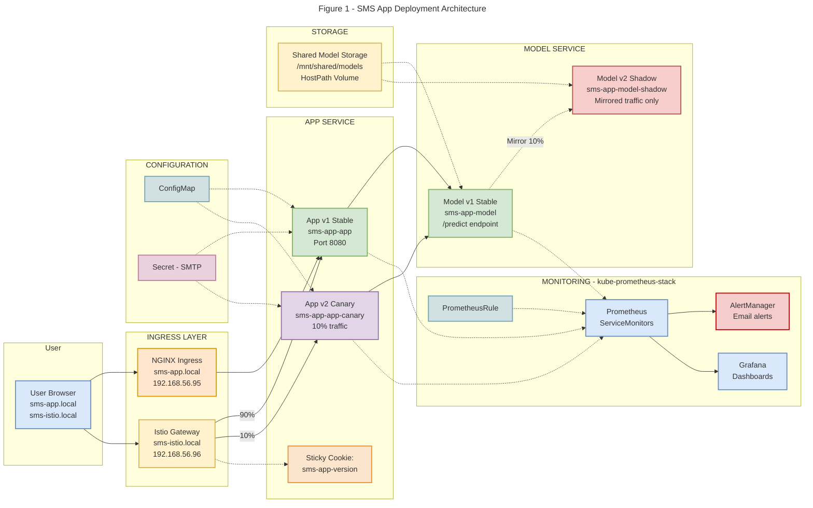

# Deployment Architecture

This document describes the final deployment architecture of the **SMS Spam Detection System** as deployed on a Kubernetes cluster provisioned using Vagrant, VirtualBox, and Ansible. It focuses on:

- How each component is deployed and interacts with the others
- How user requests flow through the system
- How Istio handles weighted and sticky routing
- How the shadow model launch is implemented
- How observability (Prometheus + Grafana) is integrated

This document is intended to give new contributors a clear, high-level understanding of the design so they can confidently participate in design and implementation discussions.

---

## Table of Contents

- [1. System Overview](#1-system-overview)
- [2. High-Level Architecture](#2-high-level-architecture)
  - [2.1 Design Decisions and Trade-offs](#21-design-decisions-and-trade-offs)
- [3. Deployment Structure](#3-deployment-structure)
  - [3.1 Kubernetes Resources](#31-kubernetes-resources)
- [4. Networking & Access Points](#4-networking--access-points)
- [5. Request Flow](#5-request-flow)
  - [5.1 Full Request Path Through The System](#51-full-request-path-through-the-system)
  - [5.2 Ingress-Level Routing (NGINX)](#52-ingress-level-routing-nginx)
- [6. Istio Traffic Management](#6-istio-traffic-management)
  - [6.1 90/10 Traffic Split](#61-9010-traffic-split)
  - [6.2 Sticky Sessions](#62-sticky-sessions)
- [7. Model Shadow Launch (Additional Use Case)](#7-model-shadow-launch-additional-use-case)
- [8. Monitoring & Observability](#8-monitoring--observability)
- [9. Storage: HostPath Model Directory](#9-storage-hostpath-model-directory)
- [10. Where Routing Decisions Happen](#10-where-routing-decisions-happen)

---

## Glossary

- **CRD (Custom Resource Definition)**  
  Kubernetes mechanism to define custom resource types (e.g., `PrometheusRule`, `ServiceMonitor`, `AlertmanagerConfig`).

- **VirtualService (VS)**  
  Istio resource that controls how requests are routed to services (e.g., 90/10 split, mirroring rules).

- **DestinationRule (DR)**  
  Istio resource that defines subsets (like `v1`, `v2`) and traffic policies (e.g., sticky sessions via cookies).

- **Subset**  
  A version-specific group of pods defined in a `DestinationRule`, typically labeled by `version` (e.g., `v1` for stable, `v2` for canary).

- **Mirroring (Shadow Traffic)**  
  Copying live traffic to another service instance (e.g., new model version) **without** affecting the user-facing response, used to evaluate new versions safely.

- **Ingress**  
  Kubernetes resource that exposes HTTP(S) services from inside the cluster to the outside world (here: NGINX Ingress at `sms-app.local`).

- **Istio Gateway**  
  Istio’s entry point for external traffic, similar to an Ingress but for Istio-managed routes (here: `sms-istio.local`).

---

## 1. System Overview

The system is an end-to-end **SMS spam detection** platform composed of:

- A **Spring Boot app service**:
  - Serves the HTML/JS web UI
  - Exposes HTTP endpoints
  - Acts as an API gateway toward the model service
- A **Python model service**:
  - Hosts the ML model for spam classification
  - Loads model artifacts from shared storage

The application is deployed to a **Kubernetes cluster** and exposed to users via:

- A classic **NGINX Ingress** for the “plain” path (`sms-app.local`)
- An **Istio Gateway + VirtualService** for the experimental path (`sms-istio.local`)

Core goals of the deployment:

- Isolate concerns (frontend/app, model, monitoring, traffic mgmt)
- Support **canary releases** (90/10 split with sticky sessions)
- Support **shadow launches** for new model versions
- Provide **observability** via Prometheus + Grafana and **alerting** via Alertmanager

The overall architecture is shown in Figure 1.



The components divided by namespace are shown in Figure 2.

```mermaid
---
title: Figure 2 - Namespace and Component Relationships
---
flowchart TB
    subgraph external[" "]
        Browser[("🌐 Browser")]
    end

    subgraph ingress-nginx["ingress-nginx namespace"]
        NGINX["NGINX Ingress<br/>192.168.56.95<br/>sms-app.local"]
    end

    subgraph istio-system["istio-system namespace"]
        IstioGW["Istio Gateway<br/>192.168.56.96<br/>sms-istio.local"]
    end

    subgraph sms-app["sms-app namespace"]
        subgraph app["App Service (Spring Boot)"]
            AppV1["sms-app-app<br/>v1 - Stable"]
            AppV2["sms-app-app-canary<br/>v2 - Canary"]
        end
        subgraph model["Model Service (Python ML)"]
            ModelV1["sms-app-model<br/>v1 - Production"]
            ModelV2["sms-app-model-shadow<br/>v2 - Shadow"]
        end
        Storage[("HostPath<br/>/mnt/shared/models")]
    end

    subgraph monitoring["monitoring namespace"]
        Prometheus["Prometheus"]
        Grafana["Grafana<br/>grafana.local"]
        Alertmanager["Alertmanager"]
    end

    Browser --> NGINX
    Browser --> IstioGW
    NGINX --> AppV1
    IstioGW --> AppV1
    IstioGW --> AppV2
    AppV1 --> ModelV1
    AppV2 --> ModelV1
    ModelV1 -.-> ModelV2
    ModelV1 --> Storage
    ModelV2 --> Storage
    AppV1 -.-> Prometheus
    ModelV1 -.-> Prometheus
    Prometheus --> Grafana
    Prometheus --> Alertmanager

    style ingress-nginx fill:#a6ffa1,stroke:#22c55e
    style istio-system fill:#c6a1ff,stroke:#a855f7
    style sms-app fill:#83e8fc,stroke:#3b82f6
    style monitoring fill:#fcec83,stroke:#eab308
```



---

## 2. High-Level Architecture

The system consists of several components deployed in the `sms-app` namespace:

- **App Service (Spring Boot)**
  Serves the frontend and acts as the API gateway.

- **Model Service (Python ML API)**
  Performs SMS classification.

- **Shadow Model Service (v2)**
  Receives mirrored traffic from v1 (for experimentation without user exposure).

- **NGINX Ingress Controller**
  Provides cluster-wide ingress at `sms-app.local`.

- **Istio Ingress Gateway**
  Used for traffic management at `sms-istio.local`.

- **Prometheus + Alertmanager + Grafana**
  Installed via `kube-prometheus-stack`, optionally enabled.

Additional infrastructure components:

- **MetalLB** (bare-metal LoadBalancer support)

- **Flannel** (pod networking)

- **HostPath shared storage** at `/mnt/shared/models` (common to all VMs)

### 2.1 Design Decisions and Trade-offs

To make the deployment easier to reason about (and to support experimentation), we made a few explicit architectural choices:

| Decision                                                                        | Why                                                                                                                                                                                                  | Trade-off                                                                                                                                                                                                     |
| ------------------------------------------------------------------------------- | ---------------------------------------------------------------------------------------------------------------------------------------------------------------------------------------------------- | ------------------------------------------------------------------------------------------------------------------------------------------------------------------------------------------------------------- |
| Use **Istio** (in addition to NGINX) for canary & shadow traffic                | Istio gives first-class support for weighted routing, sticky sessions, and traffic mirroring without changing application code. This keeps experiment logic in configuration rather than in the app. | More moving parts (Gateway, VirtualService, DestinationRule), higher operational complexity, and additional learning curve for new team members.                                                              |
| Implement **90/10 canary** with **sticky sessions via cookie**                  | A weighted canary lets us gradually roll out v2 while limiting blast radius. Sticky sessions ensure users consistently see the same version, which makes metrics and UX comparable over time.        | Individual users don’t experience both variants, so we get fewer direct A/B comparisons per user. Also, misconfiguring cookie TTL or subset labels could skew traffic.                                        |
| Use **shadow model (v2) via Istio mirroring** instead of exposing v2 directly   | Shadow launch lets us test a new model under real production traffic without impacting user-visible behavior. We can compare latency and accuracy metrics safely before promoting v2.                | Doubles the amount of inference work for mirrored requests, increasing resource usage. Shadow results are not visible to users, so additional tooling is needed to analyze them.                              |
| Store model artifacts on a **hostPath shared directory** (`/mnt/shared/models`) | Keeps Docker images small and allows updating model files without rebuilding and redeploying images. All nodes see the same model directory thanks to the shared Vagrant mount.                      | Tightly couples the cluster to the underlying VM layout; not suitable for cloud-native or multi-node storage scenarios. In a real production environment we’d likely switch to a networked or managed volume. |
| Use **kube-prometheus-stack** for monitoring & alerting                         | Reuses a well-maintained chart that bundles Prometheus, Alertmanager, Grafana, CRDs, and recommended defaults. We only have to wire ServiceMonitors, rules, and dashboards.                          | Less fine-grained control over individual components and more YAML/CRDs to understand (PrometheusRule, AlertmanagerConfig, dashboards via ConfigMaps) compared to a minimal custom setup.                     |

---

## 3. Deployment Structure

### 3.1 Kubernetes Resources

**App**

| Resource                          | Description                               |
| --------------------------------- | ----------------------------------------- |
| Deployment (`sms-app-app`)        | Stable version (v1)                       |
| Deployment (`sms-app-app-canary`) | Canary version (v2), 10% traffic          |
| Service (`sms-app-app`)           | Internal service for app pods             |
| ConfigMap                         | Provides MODEL_HOST and app configuration |
| Secret                            | Holds SMTP password                       |

**Model**

| Resource                            | Description                                       |
| ----------------------------------- | ------------------------------------------------- |
| Deployment (`sms-app-model`)        | Stable model version (v1)                         |
| Deployment (`sms-app-model-shadow`) | Shadow model (v2), receives mirrored traffic      |
| Service (`sms-app-model`)           | Internal model endpoint (ClusterIP)               |
| hostPath Volume                     | Shared model artifacts under `/mnt/shared/models` |

**Istio**

| Resource                            | Purpose                                   |
| ----------------------------------- | ----------------------------------------- |
| Gateway (`sms-app-gateway`)         | Exposes the app at `sms-istio.local`      |
| VirtualService (`sms-app-vs`)       | Defines 90/10 canary routing rules        |
| DestinationRule (`sms-app-dr`)      | Defines subsets (v1/v2) + sticky cookie   |
| VirtualService (`sms-app-model-vs`) | Defines stable + shadow routing for model |

**Ingress**

| Resource                    | Purpose                                      |
| --------------------------- | -------------------------------------------- |
| Ingress (`sms-app-ingress`) | HTTP access through NGINX at `sms-app.local` |

**Monitoring**

| Resource               | Purpose                             |
| ---------------------- | ----------------------------------- |
| ServiceMonitor (app)   | Scrapes `/actuator/prometheus`      |
| ServiceMonitor (model) | Scrapes `/metrics`                  |
| PrometheusRule         | Alerts on high request throughput   |
| Grafana dashboards     | App-level and experiment dashboards |

---

## 4. Networking & Access Points

| Component            | Hostname                                               | Source                |
| -------------------- | ------------------------------------------------------ | --------------------- |
| Application (NGINX)  | **[http://sms-app.local](http://sms-app.local)**       | NGINX Ingress         |
| Application (Istio)  | **[http://sms-istio.local](http://sms-istio.local)**   | Istio Gateway         |
| Grafana              | **[http://grafana.local](http://grafana.local)**       | kube-prometheus-stack |
| Kubernetes Dashboard | **[https://dashboard.local](https://dashboard.local)** | via NGINX Ingress     |

LoadBalancer IP assignments:

| Service       | LoadBalancer IP   |
| ------------- | ----------------- |
| NGINX Ingress | **192.168.56.95** |
| Istio Gateway | **192.168.56.96** |

---

## 5. Request Flow

### 5.1 Full Request Path Through the System

**Browser → Ingress → App → Model → Response**

```bash
+------------------+     +----------------------+
| User Browser     | --> | NGINX Ingress        | --> (HTTP routing)
+------------------+     +----------------------+
                                   |
                                   v
                          +------------------+
                          | App Service      |
                          | (v1 or v2)       |
                          +------------------+
                                   |
                                   v
                     +------------------------------+
                     | Model Service (v1 or shadow) |
                     +------------------------------+
```

> Note: We maintain two ingress paths to separate experimental traffic (sms-istio.local) from stable production traffic (sms-app.local). This isolation prevents experiment-specific failures (e.g., misconfigured VirtualService or canary subset) from impacting all users.

### 5.2 Ingress-Level Routing (NGINX)

Requests sent to `sms-app.local` are handled using this path:

```bash
Host: sms-app.local -> NGINX Ingress -> sms-app-app Service (port 80)
```

Istio does not control this traffic. It is purely a standard HTTP ingress path.

---

## 6. Istio Traffic Management

Requests sent to `sms-istio.local` pass through Istio depicted in Figure 3.

```mermaid
---
title: Figure 3 - Istio Traffic Management and Routing
---
flowchart TB
    Browser[("Browser")]

    subgraph routing["Ingress Layer"]
        direction LR
        NGINX["NGINX Ingress<br/>sms-app.local"]
        Istio["Istio Gateway<br/>sms-istio.local"]
    end

    subgraph istio-routing["Istio Traffic Management"]
        VS["VirtualService<br/>90/10 split"]
        DR["DestinationRule<br/>sticky cookie: sms-app-version<br/>TTL: 3600s"]
    end

    subgraph app-tier["App Tier"]
        AppV1["App v1 - Stable<br/>90% traffic"]
        AppV2["App v2 - Canary<br/>10% traffic"]
    end

    subgraph model-tier["Model Tier"]
        ModelVS["Model VirtualService<br/>mirror: 10%"]
        ModelV1["Model v1<br/>Production"]
        ModelV2["Model v2<br/>Shadow"]
    end

    Response[("Response to User")]

    Browser -->|"Host: sms-app.local"| NGINX
    Browser -->|"Host: sms-istio.local"| Istio

    NGINX -->|"direct routing"| AppV1

    Istio --> VS
    VS --> DR
    DR -->|"90%"| AppV1
    DR -->|"10%"| AppV2

    AppV1 --> ModelVS
    AppV2 --> ModelVS

    ModelVS -->|"serves response"| ModelV1
    ModelVS -.->|"10% mirrored<br/>fire-and-forget"| ModelV2

    ModelV1 --> Response
    ModelV2 -.->|"discarded"| X["∅"]

    style istio-routing fill:#c6a1ff,stroke:#a855f7
    style app-tier fill:#8fabff,stroke:#3b82f6
    style model-tier fill:#816fe3,stroke:#0ea5e9
```



### 6.1 90/10 Traffic Split

From values.yaml:

```bash
istio:
  canary:
    weights:
      stable: 90
      canary: 10
```

Istio forwards:

- **90% of requests to stable app pods (v1)**

- **10% of requests to canary pods (v2)**

Routing is defined in the VirtualService:

```bash
route:
  - destination:
      subset: v1
    weight: 90
  - destination:
      subset: v2
    weight: 10
```

### 6.2 Sticky Sessions

To ensure users consistently see the same version during the experiment, Istio uses a **consistent hashing cookie**:

```bash
trafficPolicy:
  loadBalancer:
    consistentHash:
      httpCookie:
        name: sms-app-version
        ttl: 3600s
```

Effect:

- First request → user is assigned version v1 or v2

- Cookie is set → same version served on subsequent requests

- Ensures stable UX and cleaner experiment data

> Important: The sms-app-version cookie ensures users see the same app version during their session. This is critical for clean experiment data, but it also means that users will not see new versions until their cookie expires (currently 1 hour).

---

## 7. Model Shadow Launch (Additional Use Case)

This feature allows us to evaluate a **new model version** without exposing it to users.

### Core Concepts

- The app continues calling the stable model (v1)

- Istio mirrors a percentage of traffic to the shadow model (v2)

- Shadow responses do not affect user-visible behavior

- Shadow logs + metrics allow comparison of v1 vs v2 offline

### How It Works

```bash
App (v1/v2)
   |
   | POST /predict
   |
   v
Model v1 (serves user)
   \
    \----> Istio Mirror ----> Model v2 (shadow)
```

### Istio Mirror Configuration

```bash
mirror:
  host: sms-app-model
  subset: v2
mirrorPercentage:
  value: 25  # configurable via values.yaml
```

This means **a configurable percentage of real classification requests** are replayed to the shadow model.

### Metrics & Evaluation

- Model metrics (`sms_model_predictions_total`, `sms_model_inference_seconds_*`) are scraped with `version` and `source` labels.
  - Stable pods report `source="app", version="v1"`; shadow pods report `source="shadow", version="v2"`.
- The Grafana “Shadow vs Stable (Model Service)” dashboard compares v1 vs v2 for request rate, inference time, and other counters.
- Prometheus quick check:
  ```
  sum by (version,source) (rate(sms_model_predictions_total{namespace="sms-app"}[1m]))
  ```
  shows mirrored traffic reaching the shadow model without affecting user responses.

---

## 8. Monitoring & Observability

The representation of metrics flow in the system is depicted in Figure 4.

```mermaid
---
title: Figure 4 - Monitoring and Alerting Pipeline
---
flowchart LR
    subgraph sms-app["sms-app namespace"]
        App["App Service<br/>/actuator/prometheus"]
        Model["Model Service<br/>/metrics"]
    end

    subgraph monitoring["monitoring namespace"]
        subgraph scraping["Metric Collection"]
            SM1["ServiceMonitor<br/>(app)"]
            SM2["ServiceMonitor<br/>(model)"]
        end

        Prom["Prometheus"]

        subgraph alerting["Alerting Pipeline"]
            PR["PrometheusRule<br/>e.g. HighRequestRate > 15/min"]
            AM["Alertmanager"]
            AMC["AlertmanagerConfig<br/>email routing"]
        end

        subgraph visualization["Dashboards"]
            Grafana["Grafana"]
            D1["Operational<br/>Dashboard"]
            D2["Experiment<br/>Dashboard"]
        end
    end

    Email[("📧 Email<br/>Notifications")]

    App --> SM1
    Model --> SM2
    SM1 --> Prom
    SM2 --> Prom

    Prom --> PR
    PR -->|"alerts"| AM
    AM --> AMC
    AMC --> Email

    Prom --> Grafana
    Grafana --> D1
    Grafana --> D2

    style sms-app fill:#83e8fc,stroke:#3b82f6
    style monitoring fill:#fcec83,stroke:#eab308
    style scraping fill:#edba8a,stroke:#facc15
    style alerting fill:#edba8a,stroke:#facc15
    style visualization fill:#edba8a,stroke:#facc15
```



Both app and model expose Prometheus metrics:

### App

- `/actuator/prometheus`

- Metrics include:
  - request counter

  - active requests gauge

  - response time histogram

  - classification counters (version-labelled)

### Model

- `/metrics`

- Includes:
  - inference latency histogram

  - request counters

  - version-labelled metrics for comparison

### ServiceMonitors

Prometheus detects endpoints automatically:

```bash
ServiceMonitor (app) → Service (app)
ServiceMonitor (model) → Service (model)
```

### Alerting

- AlertManager receives alerts from Prometheus
- PrometheusRule CRD defines alert conditions (e.g., HighRequestRate > 15 req/min)
- AlertmanagerConfig CRD routes alerts to email notifications

### Grafana Dashboards Imported Automatically

Two dashboards are deployed:

1. **Operational Metrics Dashboard**

2. **Experiment Comparison Dashboard**
   - Shows v1 vs v2:
     - throughput

     - error %

     - inference latency

     - p95 response time

These dashboards are loaded via ConfigMaps with `grafana_dashboard` labels.

---

## 9. Storage: HostPath Model Directory

All VMs mount:

```bash
/mnt/shared/models
```

`model-service` Deployment mounts:

```bash
volumes:
  - hostPath:
      path: /mnt/shared/models
```

This allows:

- Updating model versions without rebuilding images

- Persisting downloaded models across pod restarts

- Sharing models across multiple model pods

---

## 10. Where Routing Decisions Happen

The main routing and experimentation decisions are controlled by the following components:

| Decision                              | Component                            | Defined via Helm                                                                               | Can be changed at runtime?                                                 |
| ------------------------------------- | ------------------------------------ | ---------------------------------------------------------------------------------------------- | -------------------------------------------------------------------------- |
| HTTP routing (sms-app.local)          | NGINX Ingress (Kubernetes `Ingress`) | `helm/templates/ingress.yaml` + `values.ingress.*`                                             | **Yes** – update Ingress host/paths via `helm upgrade` or `kubectl apply`. |
| Istio host-based routing              | Istio `Gateway`                      | `helm/templates/istio-gateway.yaml` + `values.istio.hosts`                                     | **Yes** – change hosts or selector via `helm upgrade`.                     |
| Stable vs Canary (90/10)              | Istio `VirtualService` (app)         | `helm/templates/istio-virtualservice.yaml` + `values.istio.canary.weights`                     | **Yes** – adjust weights live via `helm upgrade` (no downtime).            |
| Version consistency (sticky sessions) | Istio `DestinationRule`              | `helm/templates/isio-destinationrule.yaml` + `values.istio.canary.stickyCookie.*`              | **Yes** – enable/disable sticky cookie or change TTL at runtime.           |
| Shadow model mirroring                | Istio `VirtualService` (model)       | `helm/templates/istio-model-virtualservice.yaml` + `values.modelService.shadow.mirror.percent` | **Yes** – adjust mirror percentage live via `helm upgrade`.                |

> **Runtime updates**: Most routing decisions can be updated without downtime by changing Helm values in `values.yaml` and running `helm upgrade`. In particular, the **90/10 traffic split** and the **shadow mirror percentage** are designed to be tuned during an experiment, so you can gradually ramp up canary or shadow traffic while the system is running.
