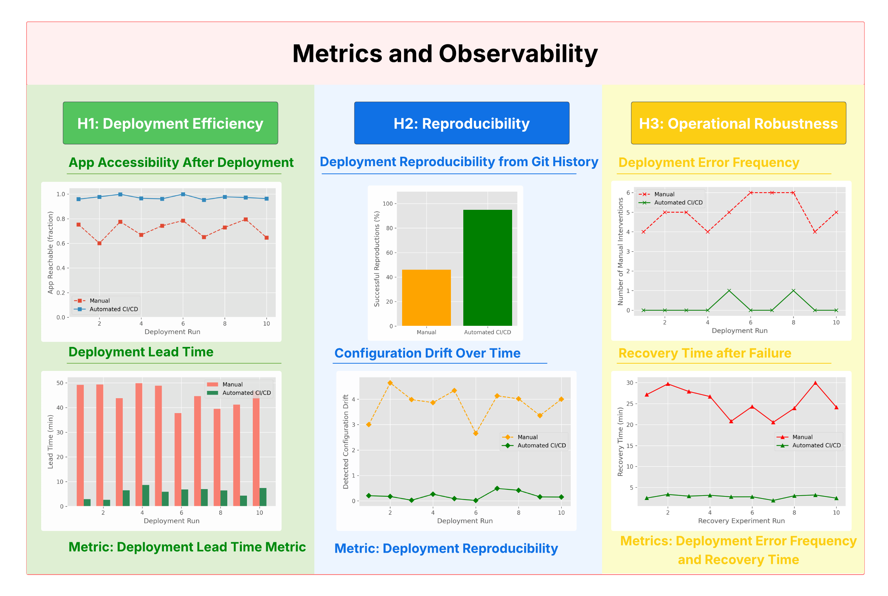

# Extension Proposal: Automated CI/CD Release Pipeline Across Multiple Repositories

## 1. Identified Shortcoming: Fragmented, Manual Release Process

### 1.1. Current state

The project is divided into three independent repositories, each serving a distinct purpose. The `app` repository contains the Spring Boot web application that serves as the frontend and API gateway, whereas the `model-service` repository contains the spam detection application itself. Finally, the `operation` repository acts as the deployment hub, containing all infrastructure-as-code components, such as the Vagrant/Ansible provisioning scripts, Helm charts for Kubernetes deployment, Istio configuration files, and Prometheus monitoring setup. For the purposes of this report, we shall ignore the `lib-version` repository.

<figure>
  
  <figcaption><b>Figure 1:</b> Current State Deployment Workflow.</figcaption>
</figure>

The current workflow is a mostly manual process, illustrated in **Figure 1**. First, a developer makes a change in the codebase. Then, they manually build the `app` and `model-service` repositories, and they push the resulting images to the GitHub Container Registry (GHCR).

This manual image building and pushing process follows our established versioning conventions: for stable releases, images are tagged with semantic versions like `v1.0.1`, while for feature branches, we use pre-release tags such as `v1.2.3-feature-x-20251217-123456`. However, there is no automated mechanism to propagate these version tags to the `operation` repository. Instead, a developer must manually navigate to the Helm chart's `values.yaml` file, update both the `app.image.tag` and `modelService.image.tag` fields with the exact versions that have just been pushed to GHCR, commit this change, and then execute `helm upgrade --install` commands against the Kubernetes cluster.

Before any deployment can occur, the infrastructure must be provisioned. A user must manually start the Virtual Machines via `vagrant up`, which triggers the Ansible playbooks to automatically provision the full Kubernetes cluster stack, including the Flannel CNI, MetalLB load balancer, NGINX Ingress Controller, and Istio service mesh. Once provisioned, the user must export the `KUBECONFIG` environment variable pointing to the generated configuration file and manually build Helm dependencies with `helm dependency build`.

Afterwards, they must complete the multi-stage Helm deployment process: first, install a basic release, then manually create the Kubernetes Secrets (such as SMTP credentials), and finally upgrade the release with additional configurations for monitoring, alerting, or Istio features. In the end, the end user must manually set up port forwarding via `kubectl port-forward` before the application becomes accessible at `http://localhost:8080`.

### 1.2. The Release Engineering Problem

The workflow described in [Section 1.1](#11-current-state) is highly fragmented and inconvenient. It represents, essentially, a problem regarding coordination and automation, where the separation of concerns that was so useful for developing the three repositories becomes a liability during the actual deployment of the application due to the absence of an integrated release mechanism. This places an excessive cognitive and operational burden on the developer and introduces opportunities for human error.

Furthermore, this can be categorized as a release engineering problem. In Google's Site Reliability Engineering (SRE) model, release engineering is concerned with designing automated, reproducible, and auditable release processes that minimize manual intervention and operational toil [1]. The current workflow violates these principles in several ways.

Firstly, versioning and propagating images across repositories is a manual process prone to human errors. Developers must independently build and push the `app` and `model-service` images, then update the `values.yaml` in the `operation` repository before running Helm commands. This step has a high risk of accidentally mismatching the versions of the cluster and the source repositories, which reduces reliability and increases the so-called "operational toil", defined in Google's SRE model as manual, repetitive work that scales linearly with system growth [1].

Secondly, orchestrating the deployment of the application is a fragmented process across repositories. Helm releases, secret management, and Istio configuration all require sequential manual actions. There is no central, automated control plane for coordinating these steps, which increases the "cognitive load" of the developer [2] and slows down the release process. Each manual intervention is a potential point of failure and contradicts the SRE principle of minimizing operational toil through automation [1].

Finally, the workflow does not provide adequate reproducibility or traceability. The DORA research program identifies "change lead time" as an important metric for DevOps performance, requiring clear tracking of when changes move from code to production [3]. However, our process lacks the traceability to measure this metric and the reproducibility to validate it. Currently, it is difficult to determine which versions of `app` and `model-service` are running in a given environment solely from the repository history - there is no single source of truth, a fundamental GitOps principle [4]. This deficiency makes rollbacks unreliable and reproducing an experiment impossible, as recreating a specific deployment state (such as "experiment X with `app v1.2.3`, `model-service v2.0.1`, and 90/10 canary routing") requires manual - and often literal - detective work on the tester's side, along with coordination across repositories. This violates the release engineering principle that deployments should be both reproducible (exactly recreatable) and auditable (clearly traceable).

What we have identified is fundamentally a release engineering problem because it affects the systematic building and deploying of software. The issues extend beyond our project to a general pattern in multi-repository microservice architectures, making the solution we will present broadly applicable.

### 1.3. Negative Impacts

The release engineering process in this project has clear negative impacts, the most tangible of which is the time to deployment. Our team tracking shows an average time of 45 minutes necessary from making a code change to accessing the application at `localhost`. This manual "toil" is not only excessive, but also increases the chances of making an error and having to spend even more time debugging it.

Additionally, the manual process introduces some security risks. Kubernetes Secrets and sensitive configurations like SMTP credentials have to be created by hand via `kubectl` commands, which leaves room for human error that could expose credentials. There is no automated validation that security best practices are followed, nor any audit trail of who created which secrets when.

Finally, the process creates bottlenecks that make parallel development difficult to execute. That is, when multiple developers work on features across different repositories, synchronising deployments becomes a sequential blocking task. The developer who completes their work first cannot deploy independently but must wait for others to finish, coordinate image builds, and manually align versions.

## 2. Proposed Extension: Cross-Repository CI/CD Pipeline

### 2.1. Vision

Our vision is to develop a unified release engineering framework that transforms the current manual workflow into an automated one. We are inspired by the GitOps principles of "declarative, versioned, and automated infrastructure management" [4], and we imagine an extension where:

1. Development and deployment are properly separated. That is, feature development is exclusively done in the `app` and `model-service` repositories, while release engineering concerns are centralized and automated through the `operation` repository.

2. The `operation` repository becomes the authoritative single source of truth for all deployment states, containing infrastructure definitions, but also explicit declarations of which software versions should run where, when, and under what conditions. This repository would serve as the definitive record of deployment history, experiment configurations, and environment states.

3. Release processes become automated, reproducible, and auditable, eliminating the manual steps identified in [Section 1.1](#11-current-state).

4. Continuous experimentation becomes a versioned process where experiment configurations are treated as declarative artifacts rather than ad-hoc manual adjustments. Experiments would be reproducible, comparable, and directly traceable to specific code versions and deployment states.

5. The entire system achieves deterministic traceability from code commit to running workload, which would enable precise measurement of DORA metrics like "change lead time" [3] and provide clear audit trails for security requirements.

Ultimately, we want our extension to go beyond our specific project to address a common release engineering pattern in microservices architectures, namely, how to coordinate the deployment of independent services. We wish to design a model applicable to any team facing similar challenges across service boundaries.

### 2.2. High-Level Design

The proposed extension introduces a centralized, declarative release architecture that restructures the current workflow around a single deployment control plane. The design establishes the `operation` repository as the deployment control plane, with the `app` and `model-service` repositories serving as specialized artifact producers. This architecture follows the GitOps principle of having a "single source of truth" for deployment state [4], and is inspired by cross-repository CI/CD patterns documented in industry literature [5] [6], which show how GitHub Actions can coordinate workflows across independent repositories while maintaining separation of concerns.

At the core of the design, the `operation` repository becomes the authoritative source of truth for the deployment state. This means that rather than developers having to manually coordinate releases across repositories, `operation` declaratively specifies which versions of `app` and `model-service` should run in each environment. Furthermore, the `app` and `model-service` repositories are conceptually reframed as **artifact producers**. Their responsibility ends at producing versioned, immutable build artifacts. Then, once the artifacts are published, deployment is influenced exclusively by the changes to the declarative state in the `operation` repository.

<figure>
  
  <figcaption><b>Figure 2:</b> High-Level Conceptual Design of the Release Pipeline.</figcaption>
</figure>

**Figure 2** illustrates the proposed architecture, which we have divided into three separate layers:

1. **Artifact Production Layer** (`app` and `model-service`). These repositories automatically build and publish versioned Docker images to GHCR when code changes are committed. Each maintains an independent CI pipeline and publishes a notification when the artifacts are ready.

2. **Deployment Control Plane** (`operation`). This central repository contains declarative environment configurations that specify exactly which artifact versions should run in each environment (staging, production, experiment). It serves as the single source of truth for the deployment state, and can be configured by the user if desired.

3. **Reconciliation Layer**. Automated workflows constantly check if the required artifacts are available, then synchronize the declared state with the running Kubernetes cluster using Helm and Istio. Any change to the declared state is traceable, reversible, and auditable.

The architecture we have presented is a generalizable pattern for multi-repository microservices deployments. It scales horizontally as new services are added, with each new repository following the same artifact-producer interface. As a result, any organization with separate repositories for different services can adopt this model to coordinate releases.

### 2.3. How it Addresses the Shortcoming

The proposed architecture directly addresses each negative impact identified in [Section 1.3](#13-negative-impacts) through three improvements:

First, it creates an automatic and reliable way of tracking what is deployed where. In the current setup, determining which versions are running requires checking multiple locations and takes a significant amount of time. Our proposed solution makes the `operation` repository the single source of truth, with every deployment recorded in Git history, preventing drift [7] between the deployed and specified versions. This provides an immediate answer to the question "what's running?" and therefore helps solve the reproducibility issue noted in [Section 1.2](#12-the-release-engineering-problem).

Second, it removes the coordination bottlenecks that slow down working in parallel. Currently, developers must manually synchronize their work across repositories, which creates delays. The event-driven solution allows developers to work in parallel: they can independently build and test their changes, while the deployment control plane automatically detects compatible versions and orchestrates coordinated releases. This eliminates the sequential blocking tasks described in [Section 1.3](#13-negative-impacts) and enables true independent development.

Third, it builds security directly into the deployment pipeline. In the current setup, managing secrets and configurations requires manually executing `kubectl` commands, which are prone to human error. Our proposed solution automates this by validating the security practices as a standard step in the pipeline, thereby addressing the security risks identified in [Section 1.3](#13-negative-impacts) while adhering to Google SRE’s principle of eliminating manual toil through automation [1].

Additionally, the solution introduces scientific experiment management for Assignment 4's requirements. Where current experiments might suffer from reproducibility problems due to the manual setup required, the extension would treat experiment configurations as versioned artifacts with clear links to specific code versions and results. This makes it so that experiments can be precisely recreated and analyzed.

## 3. Implementation Plan

This section describes how the proposed cross-repository CI/CD extension could realistically be implemented. The plan is divided into three phases, which incrementally improve the existing design and can be validated in isolation:

1. Standardizing image building
2. Establishing the deployment control plane and reconciliation layer
3. Integrating the experiment configuration as a declarative state

### 3.1. Standardize Image Building

The first phase of the implementation standardizes how Docker images are built and published in the `app` and `model-service` repositories, replacing the current manual steps with fully automated CI workflows, whose sole responsibility is producing immutable artifacts, as described in Figure 3.

<figure>
  
  <figcaption><b>Figure 3:</b> Automated Artifact Production Pipeline for the <code>app</code> and <code>model-service</code> Repositories.</figcaption>
</figure>

Each repository is extended with a GitHub Actions workflow that triggers on well-defined versioning events, such as pushes to the `main` branch or on annotated Git tags, as described in the assignment requirements. The pipeline is responsible for compiling the application, running any test suites, building a Docker image, and publishing that image to the GitHub Container Registry. It is important to note that the workflow does not contain any deployment logic, nor does it interact with the Kubernetes cluster of the `operation` repository. They are limited strictly to artifact production, as imagined in [Section 2.2](#22-high-level-design).

Versioning follows the conventions already established in the project. Stable releases are produced only when an explicit semantic version tag is pushed, while feature branches may produce pre-release images for testing purposes. Each published image is immutable, triggers a notification to the `operation` repository signaling that new artifacts are available, and, for traceability purposes, includes standard OCI metadata labels [8] that link it to its source repository, such as commit hash, build timestamp, and version tag.

Once this phase is complete, all manual `docker build` and `docker push` steps are eliminated, and every container image becomes immutable, versioned, and reproducible.

### 3.2. Create a Deployment Control Plane and Reconciliation Layer

The second phase (Figure 4) introduces the central element of the proposed extension, namely the Deployment Control Plane, implemented within the `operation` repository, that becomes the authoritative source of truth on deployment-relevant information.

<figure>
   <figcaption><b>Figure 4:</b> GitOps Reconciliation Loop between the <code>operation</code> repository and the Kubernetes Cluster.</figcaption>
</figure>

We achieve this by adding explicit environment directories, such as staging, production, and experiment, to the `operation` repository. Each should contain configuration files that declare which versions of `app` and `model-service` images are expected to run, along with any environment-specific Helm commands. These files describe what the desired deployment state should be and can be versioned through Git like any other code. As a result, Git history becomes a complete record of every deployment decision and can be inspected whenever necessary.

We further introduce a GitOps controller, such as FluxCD [9] or ArgoCD [10], into the Kuberneted cluster during the provisioning phase by extending the existing playbooks. Once installed, the controller continuously monitors the `operation` repository and reconciles the running cluster state against the declared configuration. For example, if an image tag is accidentally modified or a Helm value is manually changed in the cluster, the GitOps controller detects the change from the declared state and automatically restores the correct configuration. This “self-healing” behavior [6] helps to ensure that the deployments remain consistent. Conversely, any change to an environment configuration through a Git commit, such as updating an image tag or modifying Helm values, results in a corresponding update to the cluster.

By making the operation repository the single source of truth, this phase directly addresses the reproducibility and traceability problems identified in [Section 1.2](#12-the-release-engineering-problem). Rollbacks become trivial Git operations, deployment history is inherently auditable, and the question of “what is currently running” can be answered deterministically by inspecting the repository state.

### 3.3. Integrate the Experiment Configuration into the Project

The last phase extends the Deployment Control Plane to support experimentation in a structured and reproducible way. In the current workflow, experiments require a series of manual configuration steps and are difficult to reproduce once completed. This phase addresses that issue by treating experiment setups as declarative deployment variants, as seen in Figure 5.

<figure>
  
  <figcaption><b>Figure 5:</b> Lifecycle of an Experiment Managed through the Deployment Control Plane.</figcaption>
</figure>

Experiments are represented as environment-specific configuration files within the `operation` repository. Each experiment file explicitly defines the image versions under test, along with the necessary traffic routing strategy and any other relevant Istio settings, such as canary or A/B traffic splits. For example, a canary experiment could be represented as a Helm values override combined with an Istio VirtualService that routes a fixed percentage of traffic to a new model version. Because these configurations are applied through the same GitOps reconciliation mechanism as in [Section 3.2](#32-create-a-deployment-control-plane), experiments are also guaranteed to be traceable, auditable, and reversible.

Observability can be integrated using the existing monitoring stack. Metrics are collected through Prometheus, and Grafana dashboards are defined as version-controlled artifacts, which means the experiment results can be consistently inspected across runs. The analysis of any outcomes can be performed outside of the deployment pipeline itself, while still being traceable to the exact deployment state that produced them.

## 4. Experiment Design

This section describes how the impact of the proposed cross-repository CI/CD extension can be evaluated in a structured and reproducible manner. The goal of the experiment is to demonstrate, within the scope of this project, that the proposed changes measurably improve efficiency and reproducibility when compared to the existing manual workflow described in [Section 1.1](#11-current-state).

### 4.1. Hypothesis

Formally stated, we make the following hypotheses:

**1. H1 (Deployment Efficiency):** Introducing an automated, GitOps-based CI/CD pipeline reduces the time required to deploy a new application version compared to the current manual process.

**2. H2 (Reproducibility):**  Deployment states managed declaratively through the `operation` repository can be reliably reproduced from version control without relying on undocumented manual steps.

**3. H3 (Operational Robustness):** Automating release coordination across repositories reduces configuration mismatches and deployment-related errors.

These hypotheses directly correspond to the shortcomings identified in Sections [1.2](#12-the-release-engineering-problem) and [1.3](#13-negative-impacts).

### 4.2. Metrics

To test our hypotheses, as in Figure 6, we define the following set of measurable and observable metrics:

**1. Deployment Lead Time**, as measured by the time taken between pushing a change to a repository and the application becoming accessible at `http://localhost:8080`. This metric captures the operational impact of our automation and represents the “change lead time” concept emphasized by DORA [3].

**2. Deployment Reproducibility**, as evaluated by trying to recreate a previously deployed state using only the Git history of the `operation` repository. It is considered successful if the cluster reaches the correct declared image versions and routing configuration without needing any undocumented manual intervention.

**3. Deployment Error Frequency**, tracked qualitatively by recording any time a deployment needs any manual intervention, such as fixing an image tag mismatch or incorrect Helm values.

**4. Recovery Time**, defined as the time needed for the system to return to the declared deployment state after a failure is introduced.

<figure>
  
  <figcaption><b>Figure 6:</b> Metrics used for the Extension Experiment.</figcaption>
</figure>

### 4.3. Experiment Methodology

We compare the "before" and "after" states of the project based on the metrics in [Section 4.2](#42-metrics).

#### Step 1: Establish a Baseline

Using the current workflow, the application is deployed multiple times following the steps described in [Section 1.1](#11-current-state). For each run, the *deployment lead time* is recorded, and any *manual corrections or errors* are noted. In addition, one previously executed experiment is manually reproduced to check its *reproducibility* at the present time. Regarding the *operational robustness*, we can simulate a deployment failure, for instance, by deleting a running pod or deployment, and measure the *time required for the system to restore the desired state*. In the manual workflow, recovery requires developer intervention.

#### Step 2: Enable the CI/CD Pipeline

We enable the extension and repeat the same deployment process. Image versions are updated exclusively through commits to the `operation` repository, and deployments are triggered by the reconciliation mechanism rather than manual Helm commands. For the failure experiment, the GitOps-driven system should automatically reconcile the state, thereby reducing both downtime and human error.

#### Step 3: Analysis

The results of both phases are compared qualitatively and quantitatively, based on the metrics recorded in the previous steps.

### 4.4. Visualizations of the Results

The results of the experiment can be visualized using the existing monitoring stack introduced in Assignments 3 and 4. Figure 7 presents an example way in which they can be illustrated.

<figure>
  
  <figcaption><b>Figure 7:</b> Example Visualizations that can be used for the Experiment part of the Extension.</figcaption>
</figure>

For instance, time-series graphs in Grafana could show the *deployment lead time* before and after automation. *Deployment reproducibility* could be visualized through the reduction of configuration drift, showing the transition from partially inconsistent states to a fully declarative and synchronized deployment state. We can similarly plot the *recovery time* needed after simulated failures for both versions of the system. Finally, the *deployment error frequency* could be illustrated by experiment success rates, done through comparing the number of manual deployments that need some human intervention with the number of fully automated runs that complete without errors.

These visualizations support the central claim of the extension, which is that deployment state becomes observable, traceable, and reproducible once it is managed declaratively.

## 5. Discussion

This section is a reflection on the proposed extension and its trade-offs.

### 5.1. Assumptions

The extension relies on several important assumptions. First, it assumes that all deployable components can be packaged as immutable artifacts, specifically container images, and that these artifacts are versioned consistently across repositories. This assumption should be true in modern microservice architectures, but it may not hold in systems that rely on mutable runtime configuration or shared state outside of version control.

Second, the design assumes that Git is treated as the authoritative source of truth for deployment state and that all deployment-relevant changes are made through commits to the `operation` repository. This relies on the developers themselves maintaining a strictly disciplined workflow, a constraint that is intentional and consistent with GitOps principles [4].

Finally, the extension is designed under the assumption that the infrastructure itself does not change frequently. In this project, the Kubernetes cluster, networking stack, and supporting services are provisioned only once using Vagrant and Ansible and then remain largely static during normal operation. Because of this, the extension deliberately focuses on automating application deployments (container images, Helm values, Istio routing) rather than automating the creation or scaling of the infrastructure. However, in environments where the infrastructure itself changes frequently, the extension would not be sufficient on its own, and additional steps would be required to automate infrastructural changes alongside application releases.

### 5.2. Impact of Changes upon the Project

On a practical level, the extension makes normal releases much easier. Developers no longer have to coordinate steps across multiple repositories or manually run a lot of complex commands. They can update the deployment simply by changing the declarative configuration in the `operation` repository and letting the system apply it automatically. This reduces deployment time and makes sure that each deployment behaves consistently, which, in turn, makes the process more reliable.

The extension also improves security by limiting direct access to the cluster. Developers no longer need to store or use `.kubeconfig` files to manually deploy changes because the `operation` repository and GitOps controller enforce the deployment state. This reduces the risk of accidentally changing the configuration or exposing sensitive credentials.

Conceptually, the extension changes how deployment is thought about in the project. It goes from a sequence of actions to be executed correctly to a problem of managing state, where the desired system configuration is declared and enforced automatically. The `app` and `model-service` repositories handle building the artifacts, while the `operation` repository decides which versions run where and when. This makes the deployment state explicit and easy to inspect, instead of something that exists only as a side effect of executing commands.

This change is particularly significant for the experimentation part of the project. The experiment configurations are now treated as versioned deployment states. Each experiment can be reproduced exactly, and results can be compared reliably across runs. The project is clearly improved by moving from manually performing experiments to defining them as clear, traceable specifications, which improves both reliability and the scientific rigor of the workflow.

### 5.3. Potential Downsides

Firstly, the extension adds some complexity to the project. Modifying the existing GitHub Actions workflows, setting up a GitOps controller, and coordinating across repositories requires an initial investment of time and effort. For a small team, this workload might feel heavy compared to the manual process they are replacing, even though it will pay off once the system is running.

There is also a risk that one mistake in the `operation` repository affects all the environments at once. Where before, a manual error might only impact a single deployment, with automation, a misconfigured image tag or Helm value could propagate widely through the codebase. We can reduce the risk of this through version control and the ability to roll back changes, but testing and code review will become more important than before.

Another challenge is that some of the details of the deployment become less visible. Automation handles many of the steps that developers used to perform manually, which is a benefit in terms of reliability and speed, but it can make it harder for new team members to understand exactly what is happening in the cluster. Good documentation and observability will become necessary to ensure that the system remains transparent and maintainable.

### 5.4. Why Benefits Outweigh the Risks

Despite the downsides mentioned in [Section 5.3](#53-potential-downsides), the benefits of the proposed extension clearly outweigh the risks within the context of this project. For one, deployments become more predictable, and developers can rely on the system to produce the same outcome every time, without needing to remember sequences of manual steps. Rollbacks and experiment reproductions are similarly straightforward because every change is recorded in Git.

The initial effort to set up the extension also pays off over time. Once the system is in place, developers will spend less time coordinating releases or fixing deployment errors, which lets them focus on developing more features. The extension also scales well. When adding a new service or experiment, the developers can simply follow the same pattern of artifact production and declarative deployment. This consistency reduces the cognitive load placed on the developer and makes the workflow easier to maintain.

Beyond this project, the extension provides a pattern for coordinating deployments in any multi-repository microservice architecture. Adding new services or experiments follows the same declarative workflow, which makes the approach scalable and maintainable as the system grows.

In short, the extension turns the current fragile and manual process into a reliable and transparent one. The risks are manageable and mostly upfront, while the benefits, that is, faster deployments, reproducibility, traceability, and scalability, persist over the lifetime of the project. For this reason, the advantages clearly outweigh the costs.

## 6. References

[1] B. Beyer, C. Jones, J. Petoff, and N. R. Murphy, Eds., *Site Reliability Engineering: How Google Runs Production Systems*. Sebastopol, CA, USA: O’Reilly Media, 2016. [Online]. Available: https://sre.google/sre-book/table-of-contents/

[2] J. Sweller, “Cognitive load during problem solving: Effects on learning,” *Cognitive Science*, vol. 12, no. 2, pp. 257–285, 1988, doi: 10.1207/s15516709cog1202_4.

[3] DORA Research Program, *Accelerate: State of DevOps Report 2024*. Google Cloud, 2024. [Online]. Available: https://dora.dev/research/2024/dora-report/2024-dora-accelerate-state-of-devops-report.pdf

[4] OpenGitOps, "OpenGitOps," *OpenGitOps*, [Online]. Available: https://opengitops.dev/

[5] I. Mujagic, "Efficient Cross-Repository CI/CD: Running Targeted Tests with GitHub Actions," *The Green Report Blog*, Sep. 28, 2023. [Online]. Available: https://www.thegreenreport.blog/articles/efficient-cross-repository-cicd-running-targeted-tests-with-github-actions/efficient-cross-repository-cicd-running-targeted-tests-with-github-actions.html.

[6] P. Wollgast, "GitOps: How to Sleep Peacefully with Self‑Healing Services & Infrastructure, *applydata by DICONIUM Blog*, 9 May 2022. [Online]. Available: https://applydata.io/gitops-self-healing-services-infrastructure/.

[7] A. Totin, "Configuration drift: The pitfall of local machines," *JetBrains Blog*, 2025. [Online]. Available: https://blog.jetbrains.com/codecanvas/2025/08/configuration-drift-the-pitfall-of-local-machines/

[8] Open Container Initiative, *OCI Image Format Specification*, v1.0.2, 2021. [Online]. Available: https://github.com/opencontainers/image-spec/blob/main/annotations.md.

[9] Flux Project Authors, "Flux - the GitOps family of projects," *Flux Documentation*, 2025. [Online]. Available: https://fluxcd.io/.

[10] Argo Project Authors, "Argo CD - Declarative GitOps CD for Kubernetes," *Argo Project Documentation*, 2025. [Online]. Available: https://argoproj.github.io/cd/.

## 7. Declarative Use of Generative AI
Chatbots (ChatGPT and Claude) were used to rephrase text and improve style, structure, and grammar. They were not used to generate new content, but rather to improve the overall clarity, consistency, and readability of the report. In addition to LLMs, Grammarly has been used to correct any grammar mistakes.

Examples of prompts used:

- (ChatGPT) “How can this sentence be rephrased to sound more stylistically correct?”

- (ChatGPT) “Please correct the grammar and improve the flow of this paragraph.”

- (Claude) “Make this explanation more concise without changing its meaning.”